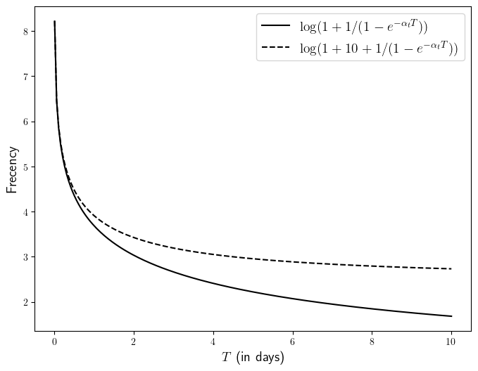

# Jumper's ranking algorithm


Jumper use both frecency (frequency+recency at which items have been visited) and match accuracy (how well the query matches the path stored in the database).

## Frecency
The frecency of a match measures the frequency and recency of the visits of the match. Assume that a match has been visited at times $T_0 > \cdots > T_n$, then at time $t$, we define
```math
{\rm frecency}(t) = \log\left(1 + 10 e^{- \alpha_1 (t - T_0)} + \sum_{i=0}^n e^{-\alpha_2 (t-T_i)} \right)
```
Here $\alpha_1 = 1e-4$ and $\alpha_2 = 3e-7$ and all times are expressed in seconds. These values are chosen so that $e^{-\alpha_1 {\rm 2 hours}} \simeq 1 / 2$ and  $e^{-\alpha_2 {\rm 1 month}} \simeq 1 / 2$.

Let us now motivate a bit the definition of frecency above. 
Let's consider an item that has not been visited within the last 10 hours, so that we can neglect the term $10 e^{- \alpha_1 (t - T_0)}$. 
Let's set $t=0$ as the origin of times.
Assume moreover that this item is typically visited every $T$ seconds, so that $T_i = - i T$ for $i=0,1,2, \dots$. Therefore
```math
\begin{aligned}
{\rm frecency}(t) 
&\simeq \log\left(1 + \sum_{i=0}^{\infty} e^{-\alpha_2 i T} \right) \\
&\simeq \log\left(1 + \frac{1}{1 - e^{-\alpha_2 T}} \right)
\end{aligned}
```

We plot this function below.


In the case where the item has just been visited, the frecency above gets an increase of $+10$ inside of the $\log$, leading to the dashed curve. This allows directories that have been very recently visited but that do not have a long history of visits (think for instance at a newly created directory) to compete with older directories that have been visited for a very long time.

As we can see from the plot above, the frecency will typically be a number in the range $[0,5]$.

## Match accuracy

The match accuracy evaluate how well the query entered by the user matches the path stored in the database.
Similarly to the fuzzy-finders [fzf](https://github.com/junegunn/fzf) or [fzy](https://github.com/jhawthorn/fzy), this is done using the variant of the [Needleman-Wunsch algorith](https://en.wikipedia.org/wiki/Needleman–Wunsch_algorithm).

This finds the match of a query in a longer path that maximizes
```
score(match) = 10 * len(query) - 9 * number-of-gaps - total-length-of-gaps + bonuses(match)
```
The `bonuses` above give additional points if matches happens at special places, such at the end of the path, or beginning of words. Then the accuracy is

```math
accuracy(query, path) = \max_{matches} score(match)

```

## Final score
Based on these two values, the final score of the match is
```math
score(query, path, t) =  2 frecency(path, t) + beta * match_score(query, match)
```
where $\beta = 1.0$ by default, but can be updated with the flag `-b <value>`. 
These additive definition is motivated by the following.

Suppose that one is fuzzy-finding a match, adding one character to the `query` at a time.
At first, when `query` has very few character (typically <=2), the `match_score` will be very small, hence the ranking will be mostly decided by the frecency.
However, as more characters are added, the ranking will favors matches that are more accurate.

## Statistical interpretation

The definitions of scores above can be motivated by the following statistical model.

Assume that the visits of a given folder $F$ is a self-exciting point process, with conditional intensity
```math
\lambda(t) = 1 + 10 e^{-alpha_1 (t - T_0(F))} + \sum_{T_k(F) \leq t} e^{-\alpha_2 (t - T_k(F))}
```
independently from the visits to the other folders.

When the user makes a query to the database, he knows already the next folder he would like to visit, which is the folder whose point process has a jump at time $t$.
The user gave his query to the algorithm, which can be seen as a noisy observation of the path of the folder the user would like to visit.

Let us model
```math
P(query|path) = \frac{1}{Z} \exp(\beta (query,path))
```
($Z$ being here the appropriate normalizing constant) meaning that the user is more likely make query that have a large accuracy.

The posterior probability is therefore propotional to
```math
\lambda(t, path) \exp(\beta (query,path))
```
The present ranking algorithm simply ranks the pathes according to their $\log$-posterior probability.
