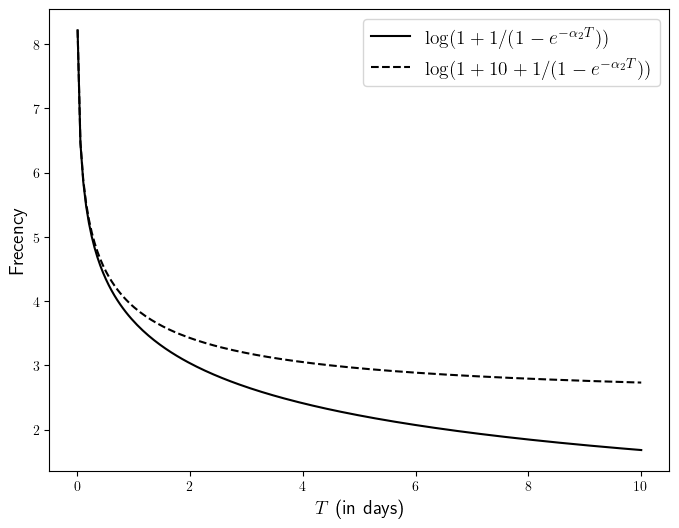
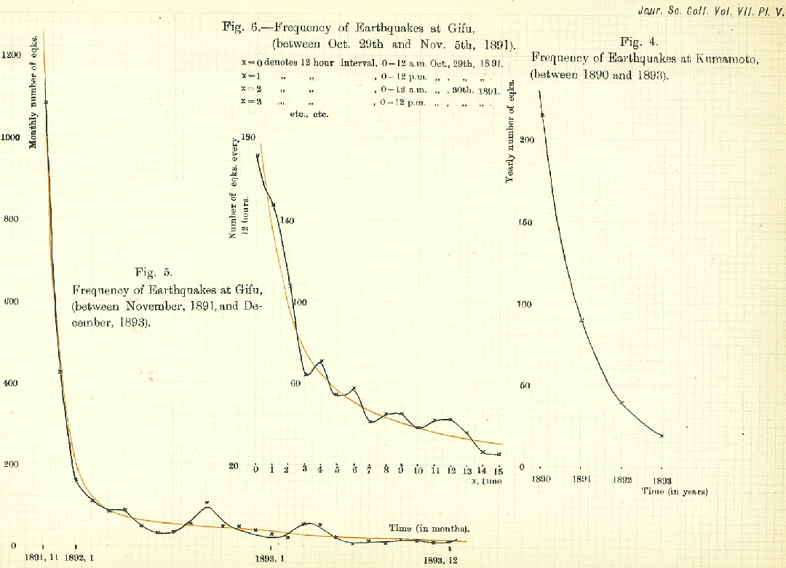

# Jumper's ranking algorithm

Jumper uses both frecency (frequency+recency at which items have been visited) and match accuracy (how well the query matches the path stored in the database).
The main idea is that, when only a few (say <=2) characters have been entered by the user (when fuzzy-finding a path), Jumper will mostly rank matches based on their frecency since these few characters contain very little information for picking the right match. However, as more characters are added, the user's prompt contains more information that can be used the improve the ranking: Jumper will put progressively more emphasis on match accuracy.

## Frecency

Frecency is an heuristic introduced by Mozilla that combines the frequency and recency.
Assume that a match has been visited at times $T_0 > \cdots > T_n$, then at time $t$, we define
```math
\text{frecency}(t) = \log\left( \epsilon + \frac{10}{1 + \alpha_1 (t - T_0)} + \sum_{i=0}^n e^{-\alpha_2 (t-T_i)} \right)
```
Here $\alpha_1 = 2 \times 10^{-5}$, $\alpha_2 = 3 \times 10^{-7}$ and all times are expressed in seconds. These values are chosen so that $\alpha_1 \times {\rm 14 \ hours} \simeq 1$ and  $e^{-\alpha_2 {\rm \ 1\ month}} \simeq 1 / 2$. $\epsilon = 0.1$ enforces that the frecency remains bounded from below.

Let us now motivate a bit the definition of frecency above. 
Let us first consider an item that has not been visited for a few days, so that we can neglect the term $10 / (1 + \alpha_1 (t - T_0))$. 
Let's set $t=0$ as the origin of times.
Assume moreover that this item is typically visited every $\Delta_T$ seconds, so that $T_i = - i \Delta_T$ for $i=0,1,2, \dots$. Therefore
```math
\text{frecency}(t) 
\simeq \log\left( \sum_{i=0}^{\infty} e^{-\alpha_2 i \Delta_T} \right)
 =  \log\left( \frac{1}{1 - e^{-\alpha_2 \Delta_T}} \right)
```
We plot this function below:

<div align="center">

</div>

In the case where the item has just been visited, the frecency above gets an increase of $+10$ inside of the $\log$, leading to the dashed curve. This allows directories that have been very recently visited but that do not have a long history of visits (think for instance at a newly created directory) to compete with older directories that have been visited for a very long time.

As we can see from the plot above, the frecency will typically be a number in the range $[0,8]$. Many other definitions for frecency are possible. We chose this one for the following reasons:
- It does not diverge at time goes. [z](https://github.com/rupa/z) uses something like `number-of-visits / time-since-last-visit`, which potentially diverges over time (and therefore require some "aging" mechanism).
- It only requires to keep track of the "adjusted" number of visits $\sum_i e^{-\alpha_2 (t-T_i)}$ and the time of last visit to be computed.
- One can give it some statistical interpretation (see below).

> [!NOTE]
> We presented above the frecency in the case where all visits had the same weight 1. However, Jumper can attribute different weights for different types of visit (using the `-w` option). Everytime a command is executed by the user, Jumper adds a visit of weight $w_i = 1$ to the current working directory (cwd) if the command has changed the cwd, and a visit of weight $w_i = 0.3$ otherwise.
> Then, the frecency is computed using the weighted sum $\sum_i w_i e^{-\alpha_2 (t-T_i)}$.

### Mozilla's original frecency definition

In its [original implementation](https://web.archive.org/web/20210421120120/https://developer.mozilla.org/en-US/docs/Mozilla/Tech/Places/Frecency_algorithm), Mozilla defines frecency as
```math
\texttt{original\_frecency}(t)
 = N \times \frac{\sum_{i \in \{\text{last 10 visits} \}} w_i f(t - T_i)}{\min(N,10)}
```
where $N$ denotes the total number of visits, $w_i$ is a weight associated to visit $i$ and $T_i$ is the time of the visit. The function $f$ is piecewise constant: $f(t) = 100$ for $t \leq 4h$, $f(t)=80$ for $t \in [4h, 24h]$ ...
This definition has then been [updated](https://wiki.mozilla.org/User:Jesse/NewFrecency) to something very similar to what jumper is using:
```math
\texttt{new\_frecency}(t) = \sum_{i=0}^n w_i e^{-\alpha_2 (t-T_i)}
```
Jumper adds a term $10 / (1 + \alpha_1 (t - T_0))$ to favor very recently accessed entries, and takes the $\log$ for reasons presented in the next sections.

### Omori's law

The following is a bit off topic, but it may still be interesting.
In 1894, Fusakichi Omori showed empirically that the frequency of aftershocks decreases roughtly as the inverse of the time after an earthquake's main shock. More precisely, he stated that the daily number of aftershocks evolves as
```math
y(t) = \frac{k}{h + t}
```

<div align="center">
From Omori (1894), "On the aftershocks of earthquakes".
</div>

The term $10 / (1 + \alpha_1 (t - T_0))$ in the definition of the frecency is of a similar shape. Note that this is not supported by any kind of empirical evidence. The main motivation for this hyperbolic behavior is that I was looking for a function that decays quickly but is "small" (e.g. < 1) only after a week.

## Match accuracy

The match accuracy evaluates how well the query entered by the user matches the path stored in the database.
Similarly to the fuzzy-finders [fzf](https://github.com/junegunn/fzf) or [fzy](https://github.com/jhawthorn/fzy), this is done using a variant of the [Needleman-Wunsch algorith](https://en.wikipedia.org/wiki/Needleman–Wunsch_algorithm).

This finds the match that maximizes
```
U(match) = - 4 * number-of-splits - 0.25 * total-length-of-gaps + bonuses(match)
```
The `bonuses` above give additional points if matches happen at special places, such at the end of the path, or beginning of words. Then the accuracy is

```math
\text{accuracy}(\text{query}, \text{path}) = \max_{\text{match}} U(\text{match}).
```
where the maximum is computed over all matches of `query` in `path`. We call "match" every (possibly non-contiguous) substring of `path` whose characters are the ones of `query`, in the same order.

## Final score
Based on these two numbers, Jumper ranks paths using
```math
\text{score}(\text{query}, \text{path}, t) =  \text{frecency}(\text{path}, t) + \beta \, \text{accuracy}(\text{query}, \text{path}).
```
where $\beta = 1.0$ by default, and be updated with the flag `-b <value>`. 
This additive definition is motivated by the following.

Suppose that one is searching for a path, adding one character to the `query` at a time.
At first, when `query` has very few character (typically <=2), all the paths containing these two characters consecutively will share the maximum `accuracy`.
Hence the ranking will be mostly decided by the frecency.
However, as more characters are added, the ranking will favors matches that are more accurate. The ranking will then be dominated by the accuracy of the matches.

## Statistical interpretation

The definitions of scores above can be motivated by the following statistical model. One can see the task of "finding the path the user thought about" given a query as a Bayesian inference problem:
- We assume that the paths picked by the user follow some prior distribution, which is based on the "frecency" of the paths.
- After picking the `path` he would like to jump to, the user is more likely to make a query that matches `path` with high accuracy. 
Hence the conditional distribution $P(\text{query}|\text{path})$ depends on $\text{accuracy}(\text{query}, \text{path})$.

Under this model, Jumper simply picks the path that maximizes the posterior probability $P(\text{path}|\text{query})$.
We give below more details about this Bayesian model.

**Prior distribution:** Assume that the visits of a given path is a self-exciting point process, with conditional intensity
```math
\lambda(t, \text{path}) = \epsilon +  \frac{10}{1 + \alpha_1 (t - T_0)} + \sum_{T_k \leq t} e^{-\alpha_2 (t - T_k)}
```
independently from the visits to the other folders.

When the user queries the database at a time $t$, he knows already the next folder he would like to visit, which is the folder whose point process has a jump at time $t$ in our model.
The user gives his query to the algorithm, which can be seen as a noisy observation of the path he is looking for.

**Conditional distribution:** We model
```math
P(\text{query}|\text{path}) = \frac{1}{Z} \exp\Big(\beta \, \text{accuracy}(\text{query},\text{path})\Big)
```
($Z$ being here the appropriate normalizing constant) meaning that the user is more likely make query that have a large accuracy.

The posterior probability is therefore proportional to
```math
P(\text{path}|\text{query}) \propto \lambda(t, \text{path}) \exp\Big(\beta \,  \text{accuracy}(\text{query},\text{path})\Big)
```
The ranking algorithm simply ranks the paths according to their $\log$-posterior probability.
